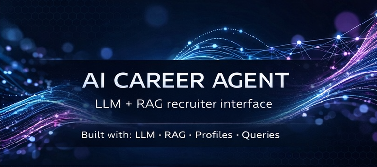

# Hi, I'm Ladislav Lettovsky

**PhD, Industrial Engineering** · Georgia Institute of Technology |
**MBA** · Cornell Johnson Graduate School of Management |
**Agentic AI Specialization** · UT Austin Postgraduate Program in AI/ML

Strategic executive leader turned AI/ML practitioner — 15 years at Sabre Corporation (Airline IT solutions), VP of Technical Sales, Director of M&A ($40M+ portfolio), Research & Development (holder of 2 US patents in airline network optimization).

---

## 🚀 AI Engineer | Agentic Systems | RAG | Tooling

> Building structured, local-first AI systems — from agents to RAG to developer tooling.

I focus on designing and building:

- Agent architectures (tool use, memory, routing)
- Retrieval-Augmented Generation (RAG) systems
- Local-first AI development workflows
- Evaluation and observability for LLM applications

## Tech Stack

## AI Portfolio & Tooling

### [ai-toolkit](https://github.com/ladislav-lettovsky/ai-toolkit)

A local-first AI CLI toolkit for creating, running, evaluating, and managing agent and RAG projects with reproducible structure and metadata-aware lifecycle management.

- Built a local-first CLI platform for scaffolding and managing AI agent and RAG projects
- Added project lifecycle commands including inspect, eval, doctor, clean, run, and upgrade
- Implemented agent features such as memory, logs, typed tools, safe file writing, and config layering
- Added RAG project generation with ingestion, chunk indexing, retrieval, and evaluation support

---

### [ai-delivery-exception-system](https://github.com/ladislav-lettovsky/ai-delivery-exception-system)

A multi-agent system that detects, triages, resolves, and communicates last-mile delivery exceptions using LangGraph orchestration.

     

- Multi-agent orchestration with supervisor pattern and specialized worker agents
- Vector similarity search (Chroma + HuggingFace embeddings) for resolution matching
- End-to-end pipeline: detection → triage → resolution → customer notification
- LangSmith observability for tracing and debugging agent behavior

---

### [ai-ehr-assistant](https://github.com/ladislav-lettovsky/ai-ehr-assistant)

A guardrailed, patient-facing AI assistant that explains Electronic Health Records in plain language with strict safety enforcement.

    

- ReAct agent with 4-node state machine: agent → tool → validate → policy
- 11 patient-scoped tools with deterministic safety routing (12 policy rules)
- 7-dimension validation rubric scored by GPT-4o — **10/10 test cases passed**
- Multilingual support, health literacy adaptation, and PHI protection

---

### [ai-rag-knowledge-analyst](https://github.com/ladislav-lettovsky/ai-rag-knowledge-analyst)

A RAG pipeline that enables analysts to extract insights from lengthy business reports through natural-language queries.

    

- Full RAG pipeline: PDF → chunking → embedding → Chroma → retrieval → generation
- Three-mode comparison: raw LLM vs. prompt-engineered vs. RAG (grounded)
- Hybrid retrieval infrastructure (BM25 + vector similarity)
- RAG achieves **1.0 groundedness** where plain LLM scores 0.0

---

## Background

- **VP, Head of Sales Engineering** at Sabre Corporation (2022–2024) — Led airline IT solutions technical sales, 20+ solution architects, exceeded global sales target 2x
- **Director, New Business Ventures & M&A** at Sabre Corporation (2009–2022) — Led LATAM Airlines Group PSS implementation, 3 acquisitions + 1 divestiture ($40M+)
- **2 US Patents** in airline network design and passenger reaccommodation
- **Languages**: Czech (native) · English (native)

## Connect

